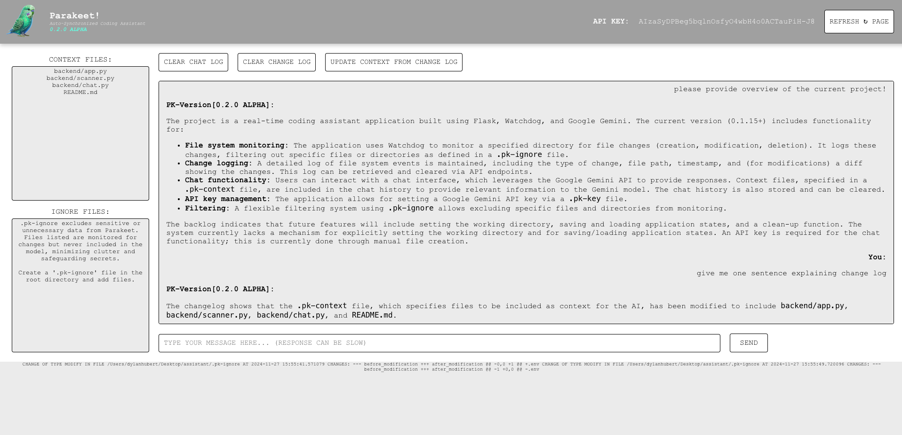
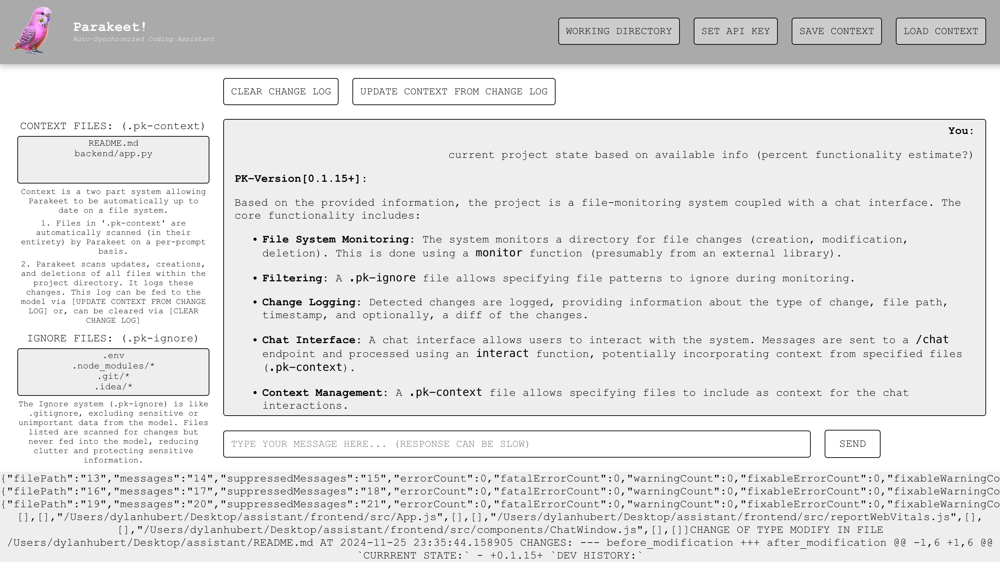
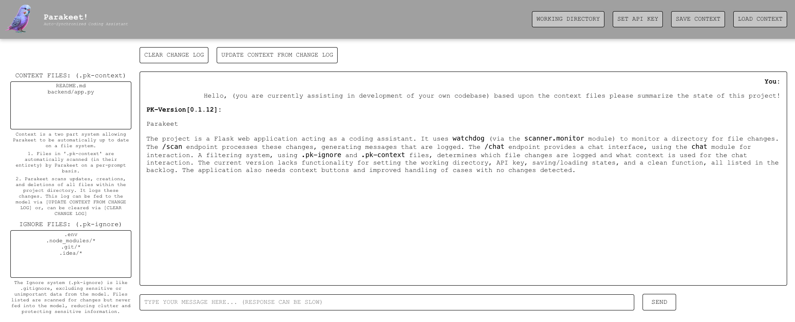
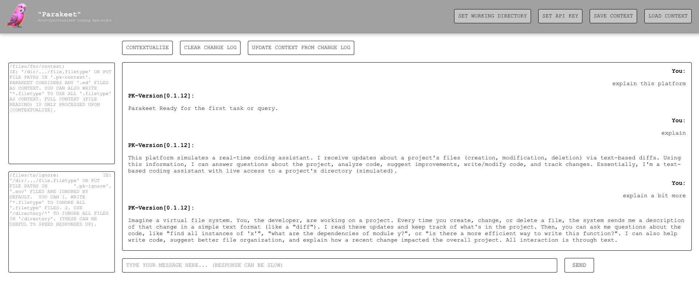
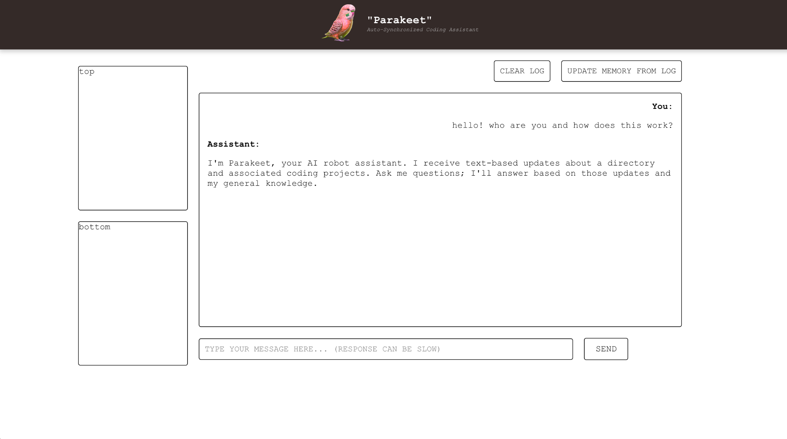

`CURRRENT STATE:`

0.2.0 ALPHA (LOCAL BUILD)

`DEV HISTORY:`

0.1.15+

0.1.15

0.1.13

0.1.10

`BACKLOG:`

FIGURE OUT HOW TO DEPLOY...
CODE FORMATTING (prism.js or highlight.js)

`DOCUMENTATION:`

python app.py

