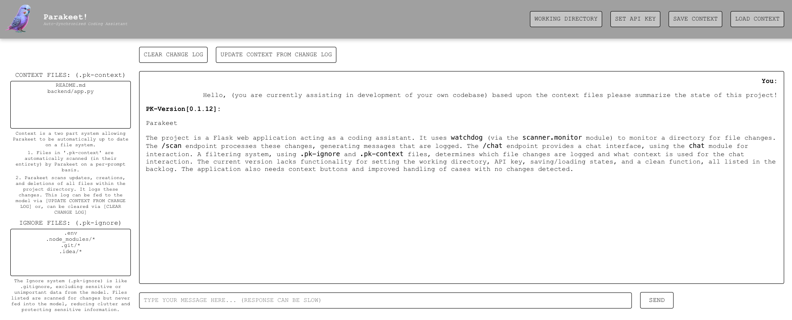

`CURRRENT STATE:`

`BACKLOG:`

`0.1.14 —.pk-context & .pk-ignore (filtering system)` DONE

`0.1.15 — context buttons` DONE

`0.1.16 — set working directory` 

`0.1.17 — set api key`

`0.1.18 — save and load states`

`0.1.19 — clean`

`0.1.20 —`

`DOCUMENTATION:`

TEST MESSAGE IS: BLUE CAT

